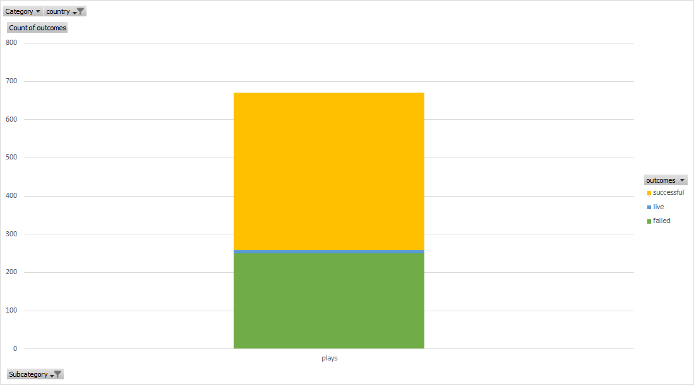

# An Analysis of Kickstarter Campaigns
In this analysis, we are helping Louise, an up-and-coming playwrite, determine the parameters for fundraising for her play Fever.
In order to assist Louise, we:
  1. Filtered data from Kickstarter by the Category: Theater and Subcategory: Plays and created graphs to viualize the distribution of          successful, live and failed outcomes.

